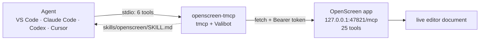

# openscreen-tmcp

A tiny MCP server that sits in front of [OpenScreen](https://getopenscreen.com)'s own MCP server and collapses its **25 tools into 6** — so any AI agent can edit video for far fewer tokens, with the house `action`-enum style and a bundled Agent Skill carrying the workflow knowledge.



It is a **proxy**: every mutation is executed by OpenScreen. No editing logic is reimplemented, no session state is kept, and upstream's error wording is passed through verbatim.

## Install

```bash
bunx --package openscreen-tmcp openscreen-tmcp
```

Configuration (e.g. VS Code `mcp.json`, Claude Code, Codex):

```jsonc
"openscreen-tmcp": {
  "command": "bunx",
  "args": ["--package", "openscreen-tmcp", "openscreen-tmcp"],
  "env": {
    "OPENSCREEN_MCP_URL": "http://127.0.0.1:47821/mcp",
    // paste the header value verbatim, "Bearer " included:
    "OPENSCREEN_MCP_AUTHORIZATION": "Bearer <token from OpenScreen>",
    // or just the bare token — the env var OpenScreen's own Codex setup uses:
    // "OPENSCREEN_MCP_TOKEN": "<token from OpenScreen>"
  }
}
```

Get the URL and token from the OpenScreen app: **AI settings → MCP server → copy the shown command**. The agent never sees the token. `OPENSCREEN_MCP_AUTHORIZATION` wins if both are set.

Optional: `OPENSCREEN_TMCP_TIMEOUT_MS` (default `15000`) and `OPENSCREEN_TMCP_DEBUG=true` (verbose **stderr** logging).

## The 6 tools

| Tool      | Actions                                                                          | Absorbs upstream                                                                                |
| --------- | -------------------------------------------------------------------------------- | ----------------------------------------------------------------------------------------------- |
| `read`    | `project`, `cursor`, `transcript`, `words`, **`frames`**, `upstream`              | getCurrentDocument, getCursorTrack, getTranscript, getTranscriptWords + a local coverage report + local ffmpeg frame rendering |
| `trim`    | `add`, `addMany`, `set`, `remove`                                                | addTrim, addTrims, setTrim, removeTrim                                                          |
| `clip`    | `setRange`, `move`, `remove`, `replace`                                          | setClipRange, moveClip, removeClip, replaceTimeline                                             |
| `effect`  | `add`, `set`, `remove` × `kind` ∈ zoom \| speed \| annotation \| camera \| audio | 11 effect ops + removeModifier                                                                  |
| `caption` | `wordId` + `text`                                                                | setWordText                                                                                     |
| `apply`   | ordered batch of the above                                                       | —                                                                                               |

Coverage is exact: 4 + 4 + 4 + 12 + 1 = **25**, proved by `test/coverage.test.ts` — if OpenScreen ever renames a tool, that test fails with the unmapped name.

Annotations stay honest after consolidation: `read` is the only `readOnlyHint: true` tool (that's why the single transcript _write_ lives alone in `caption`), every edit tool carries `destructiveHint: true`.

`read` with `action: "frames"` is local: ffmpeg renders the recording as an image, a contact sheet of evenly spaced frames or one still at an exact second, with timestamps burned in when a caption font is found (a false `burnIn` in the reply means none were drawn). It is how an agent sees the video before it edits.

## The rule that matters

**Two time bases — never mix them.** `trim` and `clip` `sourceStartSec`/`sourceEndSec` are **SOURCE** seconds (inside the original file); everything in `effect` is **VIRTUAL** seconds (on the edited timeline, after cuts). So: **cut first, then decorate.** The full workflow lives in the bundled [skill](./skills/openscreen/SKILL.md).

`apply` is ordered, **not atomic** — OpenScreen has no transaction, so it stops at the first failure and reports exactly which ops landed.

## Development

```bash
bun install     # dependencies
bun test        # 77 tests: apply, client, config, coverage, dispatch, frames, resolve
bunx tsc --noEmit
bun run dev     # watch mode
```

The upstream endpoint is hand-rolled (`fetch` + JSON-RPC, ~150 lines) because tmcp ships no client package and `@modelcontextprotocol/sdk` is out of bounds for this repo — see [plan/client-leg.md](./plan/client-leg.md).

## License

MIT
